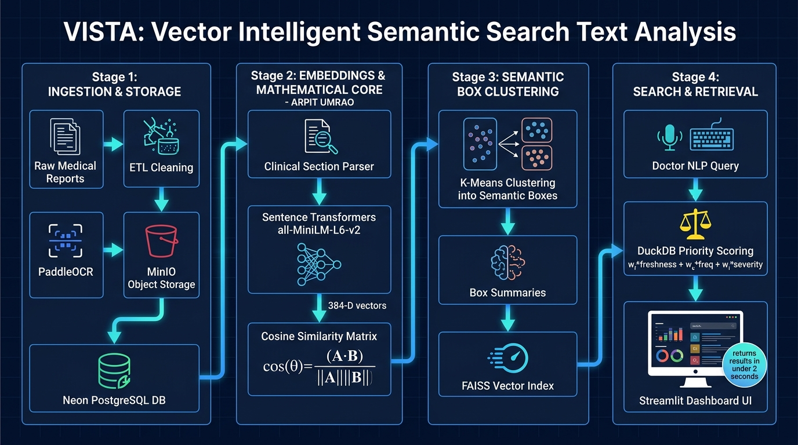

<p align="center">
  
</p>

<h1 align="center">VISTA: Vector Intelligent Semantic Search Text Analysis</h1>

<p align="center">
  A semantic healthcare data warehouse platform that organizes and retrieves medical reports based on <b>meaning</b>, not just keywords — powered by box-clustering, transformer embeddings, cosine similarity, and priority-based ranking.
</p>

<p align="center">
  
  
  
</p>

<p align="center">
  <a href="info/DOCUMENTATION.md">
    
  </a>
</p>

---

## 📊 Project Statistics & Targets

<p align="center">

| 📄 Medical Reports | 🏥 Medical Departments | 🧠 Embedding Size | ⚡ Average Search | 🎯 Semantic Accuracy Target |
|:---:|:---:|:---:|:---:|:---:|
| **5,000+** | **40+** | **384-D** | **< 2 sec** | **95%** |

</p>

---

## 📌 Problem Statement

Hospitals generate millions of medical reports every year — discharge summaries, lab results, radiology notes, prescriptions, and clinical observations. Traditional hospital storage relies on fragmented folder structures and rigid keyword-based search, making it difficult to retrieve semantically related reports when terminology differs across departments (e.g. *"heart attack"* vs. *"myocardial infarction"*).

**The traditional hospital search bottleneck:**

```
Doctor ──> [ Keyword Query ] ──> Fails on synonyms, takes several minutes
             ├── Fragmented PDFs & Bills
             ├── Multi-departmental Notes
             └── Disconnected Legacy Storage
```

This leads to:
- 🔁 Duplicated documentation and fragmented patient files
- ⏱️ Delayed diagnosis and slower historical case reviews
- 📉 Inefficient clinical search causing operational drag
- 📈 Compounding administrative burden as clinical data lakes expand

Additionally, embedding **every single document** individually is computationally expensive at scale — VISTA's core research question is whether **grouping documents into semantic "boxes" first** can match the retrieval quality of full per-document embedding search, at a fraction of the compute cost.

---

## 💡 Proposed Solution

**VISTA** eliminates keyword barriers by understanding the underlying clinical meaning behind medical text — and instead of embedding every raw file, it clusters documents into semantic **boxes** (e.g. "blood reports," "radiology notes") and embeds only a short summary per box. A query first matches to the closest box, then a **priority score** (freshness + call frequency + importance) pinpoints the exact file within it.

**The VISTA accelerated workflow:**

```
Doctor ──> Natural Language Query ──> Query Embedding ──> FAISS Box Match ──> Priority-Ranked File (< 2s)
```

- **Context-aware** — recognizes clinical synonyms instantly
- **Self-organizing** — automatically clusters medical reports by underlying pathology into labeled boxes
- **Compute-efficient** — searches across box summary embeddings, not every individual document
- **Priority-aware** — surfaces the most relevant file within a box using freshness, access frequency, and importance

---

## 🏗️ System Architecture & Workflow

<p align="center">
  
</p>

**The end-to-end pipeline:**

1. **Raw Medical Reports** (PDFs, images, text) enter the system
2. **ETL Pipeline** — cleans files, deduplicates, removes errors *(Owner: Aashita)*
3. **OCR Processing** — PaddleOCR extracts text from image-based/scanned reports *(Owner: Aditi)*
4. **Storage** — raw files → **MinIO**; structured metadata → **Neon (PostgreSQL)** warehouse, linked by a stable `document_id` *(Owner: Ankit)*
5. **Metadata Analytics** — DuckDB analyzes freshness and call-frequency signals *(Owner: Anant)*
6. **Document Embeddings** — Sentence Transformer (`all-MiniLM-L6-v2`) vectorizes cleaned text *(Owner: Arpit)*
7. **Cosine Similarity Computation** — pairwise document similarity, normalized and verified *(Owner: Arpit)*
8. **K-Means Clustering** — groups documents into semantic "boxes" *(Owners: Ansh, Ankit)*
9. **Box Summary Generation + Embedding** — a short summary is generated per box and embedded *(Owners: Ansh, Ankit, Arpit)*
10. **FAISS Index** — indexes box summary embeddings only, not every document *(Owners: Ansh, Ankit)*
11. **Priority Scoring Layer** — `priority_score = freshness + call_frequency + importance` *(Owner: Anant)*
12. **User NLP Query** → embedded → matched to nearest box via FAISS → **File Selection Within Matched Box** using the priority score → **Ranked Result Returned to User**

### Per-role breakdown

| Owner | Focus | Key Deliverables |
|---|---|---|
| **Aashita** | ETL Pipeline | Raw reports → duplicate detection → error removal → cleaned file batch |
| **Aditi** | OCR & Text Extraction | PaddleOCR on scanned reports, normalized text output |
| **Ankit** | Storage & Data Warehouse | MinIO raw storage + Neon structured warehouse, linked by `document_id` |
| **Anant** | Metadata Analytics & Priority Scoring | DuckDB analytics → freshness/frequency/importance → priority score |
| **Arpit** | Embeddings & Similarity Math | Sentence Transformer → document embeddings → cosine similarity matrix, handed off for clustering |
| **Ansh** | Clustering & Box Embedding Pipeline | K-Means boxes → box summaries → box embeddings → FAISS query matching |

---

## 🧮 How Cosine Similarity Works

Instead of raw coordinate distance — which biases toward document length — cosine similarity calculates the geometric angle (θ) between two high-dimensional text vectors:

$$\cos(\theta) = \frac{A \cdot B}{\Vert A \Vert \Vert B \Vert}$$

| Score Range | Meaning |
|:---:|---|
| **1.0** | Near-identical clinical meaning |
| **0.8+** | Highly related medical context |
| **0.5** | Moderately related context |
| **0.0** | Completely unrelated records |
| **-1.0** | Semantically opposite concepts |

This similarity matrix is what feeds K-Means clustering when building the semantic boxes.

---

## ⚙️ Technology Stack

| Layer | Technology | Purpose |
|---|---|---|
| 🐍 **Programming** | Python | Core analytical engine & data processing |
| 🔎 **OCR** | PaddleOCR (PP-OCRv5/v6) | Text extraction from scanned/image-based reports |
| 🧠 **AI & Embedding** | Sentence Transformers (`all-MiniLM-L6-v2`) | Translates cleaned text into 384-D vectors |
| 📐 **Similarity & Clustering** | Cosine Similarity + K-Means | Groups documents into semantic "boxes" |
| ⚡ **Vector Search** | FAISS | Indexes box summary embeddings for fast retrieval |
| 📊 **Metadata Analytics** | DuckDB | Freshness & call-frequency analysis feeding priority scoring |
| ☁️ **Object Store** | MinIO | Persistent unstructured raw report storage |
| 📦 **Data Warehouse** | Neon (PostgreSQL) | Structured metadata warehouse, linked via `document_id` |
| 📈 **Frontend UI** | Streamlit | Real-time diagnostic analytical dashboard |
| 🐳 **Deployment** | Docker | Containerized configuration and microservice scaling |

---

## 📂 Repository Structure

```text
VISTA
├── Backend/
│   ├── Embeddings/           # Sentence Transformer + cosine similarity math (Arpit)
│   ├── Clustering/           # K-Means box logic, box summaries, FAISS index (Ansh, Ankit)
│   ├── ETL/                  # Cleaning, deduplication, error removal (Aashita)
│   └── OCR/                  # Document parsing and extraction (Aditi)
├── project/code/
│   ├── vista_ocr/            # Integrated PaddleOCR extraction engine
│   ├── vista_pipeline/       # Layered ETL pipeline (ASTRA-style, MinIO-backed)
│   ├── run_phase1.py         # Phase-1 ETL orchestrator (ingest -> clean -> summarize)
│   ├── ocr_reports.py        # Resumable PaddleOCR runner for report PDFs
│   └── build_result.py       # Assembles RESULT/clean_data/
├── Database/
│   ├── MinIO/                # Raw file object storage (Ankit)
│   ├── Neon/                 # Structured metadata warehouse (Ankit)
│   └── DuckDB/               # Metadata analytics + priority scoring (Anant)
├── Frontend/
│   └── Streamlit/            # UI components and diagnostic dashboard
├── docs/                     # Academic synopses, presentation slide decks, and reports
├── RESULT/clean_data/        # Clean corpus for embedding and vector search
└── tests/                    # Unit and integration test suites
```

---

## 🚀 Running the Project

### 1. Start Supporting Services (MinIO)
```bash
# Using helper script
bash manage_vista.sh up

# Or using docker-compose
docker-compose up -d
```

### 2. Run Phase 1 Ingestion & OCR Pipeline
```bash
# 1. ETL: raw -> clean -> summaries -> MinIO
python project/code/run_phase1.py

# 2. PaddleOCR over report PDFs
python project/code/ocr_reports.py

# 3. Assemble clean RESULT dataset
python project/code/build_result.py
```

### 3. Run Embeddings & Similarity Math Pipeline (Arpit's Module)
```bash
# Generate 384-D embeddings, cosine similarity matrix, and handoff bundle
python Backend/Embeddings/pipeline.py --sample-size 50
```

### 4. Run Frontend Search Dashboard
```bash
streamlit run Frontend/Streamlit/app.py
```

---

## 🎯 Accuracy Targets & Evaluation Benchmarks

To ensure clinical viability, VISTA evaluates accuracy across three key layers:

1. **Semantic Retrieval Accuracy Target: `95%`**
   * Measured via **Top-3 Retrieval Accuracy**: A clinical query for a condition (*e.g., "acute myocardial infarction"*) must return a document from the correct medical department in the top 3 results at least **95%** of the time.
2. **Specialty Separability Ratio Target: `> 2.0x` (Achieved: `4.63x`)**
   * Intra-specialty cosine similarity must be at least **2× higher** than inter-specialty similarity to ensure clear geometric cluster boundaries.
3. **Retrieval Latency Target: `< 2.0 seconds`**
   * End-to-end response time from user query submission to ranked report display.

---

## 📄 License

This project is licensed under the MIT License — see the [LICENSE](LICENSE) file for details.
